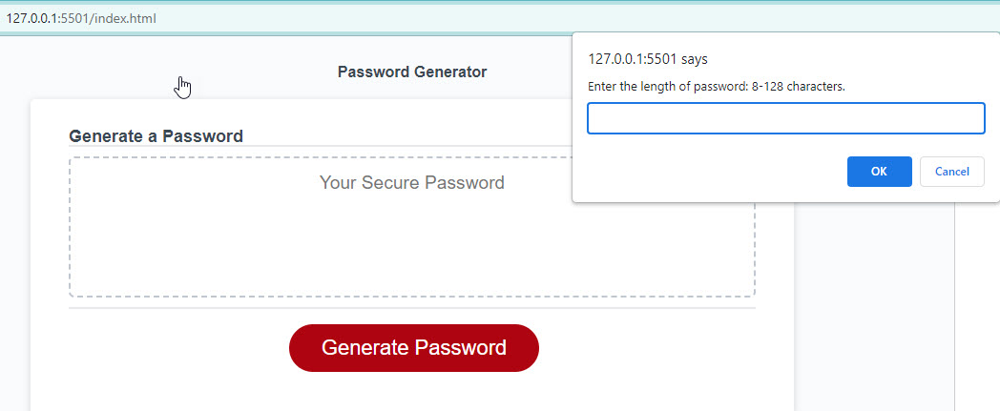
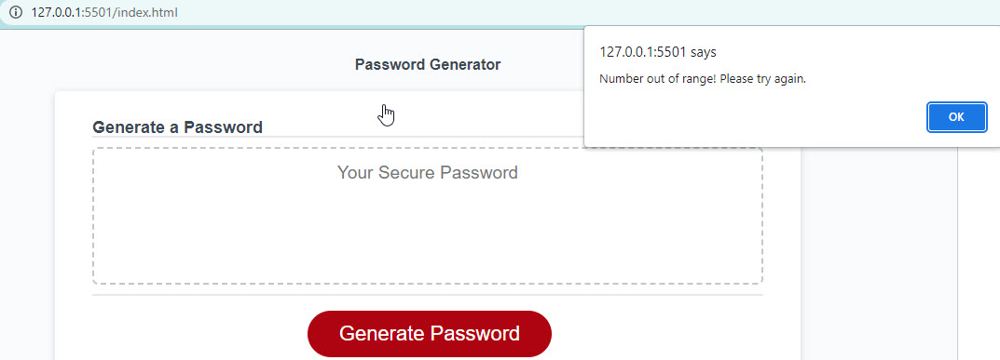
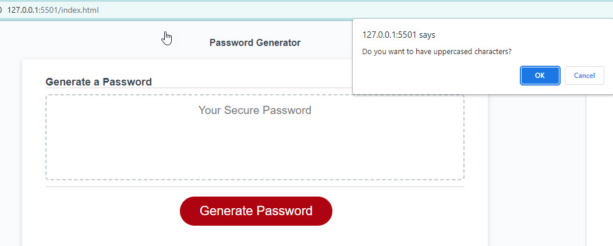
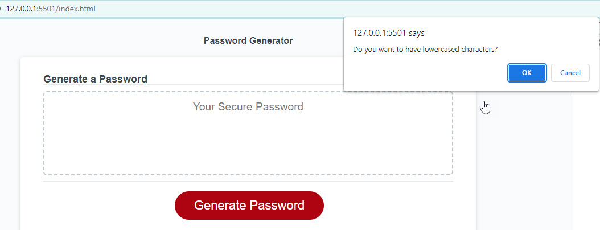
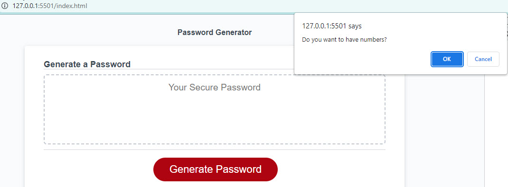
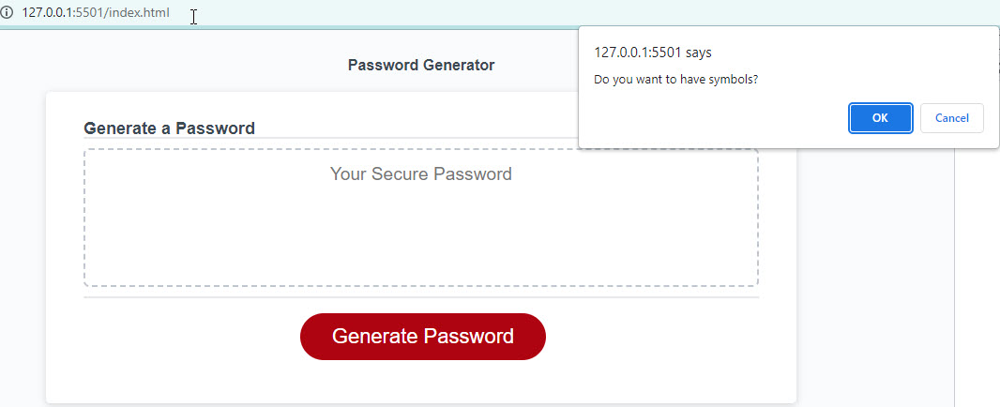
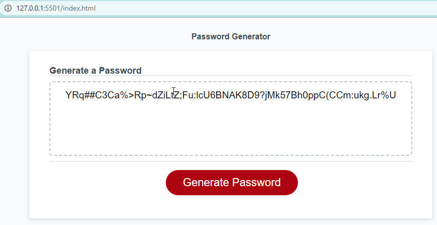

# Password Generator 

## Description

Application created for Password generation purposes and Users can run this application and create a more secure password. 
This application generates a random password based on user-selected criteria. The application validates the user input and ensures that at least one character type is selected. Once all prompts are answered, the user will be presented with a password matching the answered prompts. This application is also responsive, ensuring that it adapts to multiple screen sizes.

## Usage

1. Open the password generator URL in your browser.
2. Generate a random password by clicking the "Generate Password" button and following the prompts.

## Technology

* HTML
* CSS
* JavaScript

## Link

Github repository:
https://github.com/SerhiyZv/password-generator-javascript.git

Life application:
https://serhiyzv.github.io/password-generator-javascript/

## Screenshots

